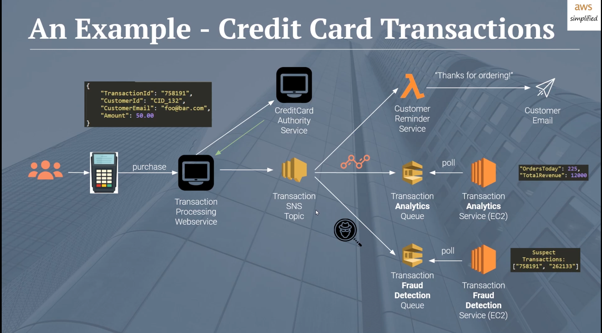

# Infra for the boxing robot

## What arch?

TODO when we know what we have done here we can talk more about it :D

## SQS vs SNS

> Do **other systems** care about an event?

SNS, as SNS is what we use to send put events to other systems. it could be a SQS queue, lambda or whatever. But a queue is a good idea as even if something breaks the message is persisted
 
 

> Do **you** care if something happened?

SQS, if our application wants to respond to events it needs to have a queue to poll (in many cases) to say "did something change yet". Then you can process that when you get to it.
